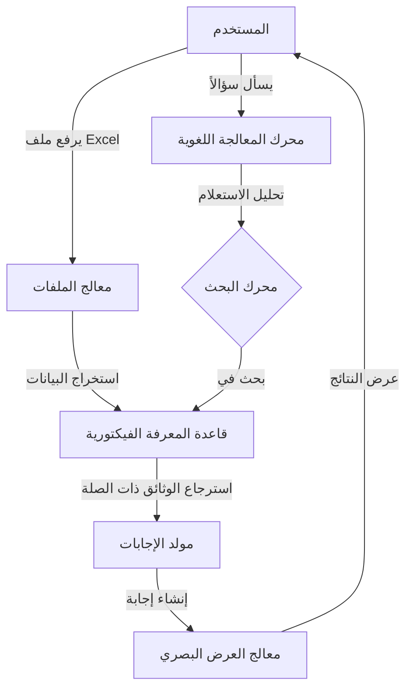

# RA-ServExcel
RAG combines retrieval and generation to improve answer accuracy using AI models and external knowledge sources efficiently.
# ServExcel
[](https://github.com/username/ServExcel/stargazers)
[](https://github.com/username/ServExcel/network/members)
[](https://github.com/username/ServExcel/blob/main/LICENSE)

<p align="center">
  
</p>

## 🎥 عرض المشروع

<p align="center">
  <a href="https://youtu.be/your-video-id">
    
  </a>
  <br>
  <em>اضغط على الصورة لمشاهدة فيديو العرض التوضيحي</em>
</p>

## 📝 وصف المشروع

**ServExcel** هو نظام متقدم للبحث والاسترجاع المعزز (RAG - Retrieval Augmented Generation) مصمم خصيصاً للعمل مع ملفات Excel وتحويلها إلى قواعد معرفية ذكية قابلة للاستعلام. يتيح المشروع للمستخدمين طرح أسئلة بلغة طبيعية والحصول على إجابات دقيقة مستخرجة مباشرة من البيانات الموجودة في جداول Excel المعقدة، مما يسهل الوصول إلى المعلومات بدون الحاجة إلى مهارات برمجية أو تحليلية متقدمة.

## ✨ العروض التوضيحية

<p align="center">
  
</p>

## 🚀 المميزات الرئيسية

- ✅ **معالجة ذكية لملفات Excel**: تحويل تلقائي لأي ملف Excel إلى قاعدة معرفية قابلة للبحث
- ✅ **واجهة محادثة طبيعية**: طرح الأسئلة والاستفسارات بلغة بسيطة والحصول على إجابات دقيقة
- ✅ **تصور البيانات**: عرض البيانات المسترجعة بصورة رسومية سهلة الفهم
- ✅ **دعم العمليات الحسابية المعقدة**: إجراء عمليات حسابية متقدمة على البيانات المستخرجة
- ✅ **التخصيص والتكامل**: دمج النظام بسهولة مع تطبيقات وأنظمة أخرى
- ✅ **متعدد اللغات**: دعم العربية والإنجليزية ولغات أخرى
- ✅ **التصدير والمشاركة**: تصدير النتائج بتنسيقات متعددة ومشاركتها بسهولة

## 🛠️ التقنيات المستخدمة

<p align="center">
  
  
  
  
  
  
  
</p>

## 📋 متطلبات التشغيل

- Python 3.8+
- CUDA المتوافق (للتشغيل بالـ GPU - اختياري ولكن موصى به)
- 8GB RAM على الأقل (16GB موصى به للملفات الكبيرة)
- مساحة تخزين 5GB على الأقل

## ⚙️ طريقة التثبيت

```bash
# استنساخ المشروع
git clone https://github.com/username/ServExcel.git

# الانتقال إلى مجلد المشروع
cd ServExcel

# إنشاء وتفعيل بيئة افتراضية
python -m venv venv
source venv/bin/activate  # لنظام Linux/Mac
# أو
venv\Scripts\activate  # لنظام Windows

# تثبيت المتطلبات
pip install -r requirements.txt

# تشغيل المشروع
python run.py
```

يمكنك أيضاً استخدام Docker:

```bash
docker-compose up -d
```

## 📷 لقطات شاشة

<div align="center">
  <div style="display: flex; justify-content: space-between; margin-bottom: 20px;">
    
    
  </div>
  <div style="display: flex; justify-content: space-between; margin-bottom: 20px;">
    
    
  </div>
  <div style="display: flex; justify-content: space-between;">
    
    
  </div>
</div>

## 🔄 هيكلية المشروع



## 📊 أداء النظام

<p align="center">
  
</p>

## 🌟 حالات استخدام

- **التحليل المالي**: استخراج رؤى واتجاهات من البيانات المالية المعقدة
- **إدارة المخزون**: متابعة وتحليل بيانات المخزون والمبيعات
- **التقارير التنفيذية**: إنشاء ملخصات وتقارير من البيانات الضخمة
- **التحليل الإحصائي**: إجراء عمليات إحصائية معقدة بأوامر بسيطة
- **دعم القرار**: استخلاص معلومات لدعم اتخاذ القرارات الاستراتيجية

## 🔒 الأمان والخصوصية

يضمن ServExcel خصوصية كاملة للبيانات مع معالجة محلية للملفات. لا يتم تخزين البيانات على خوادم خارجية، ويتم تشفير كافة الملفات أثناء المعالجة.

## 🌐 الإصدارات المتاحة

- **الإصدار المجتمعي**: متاح مجاناً للاستخدام الشخصي والتعليمي
- **الإصدار المؤسسي**: يشمل ميزات متقدمة للشركات والمؤسسات
- **الإصدار السحابي**: خدمة مستضافة مع واجهة ويب سهلة الاستخدام

## 📞 التواصل والدعم

- 📧 البريد الإلكتروني: support@servexcel.ai
- 💬 منتدى المجتمع: [community.servexcel.ai](https://community.servexcel.ai)
- 🐦 تويتر: [@ServExcelAI](https://twitter.com/ServExcelAI)

## 📄 الترخيص

هذا المشروع مرخص بموجب [MIT License](LICENSE).

## 🙏 شكر وتقدير

نشكر كافة المساهمين في تطوير هذا المشروع وكذلك المكتبات مفتوحة المصدر التي تم استخدامها.
